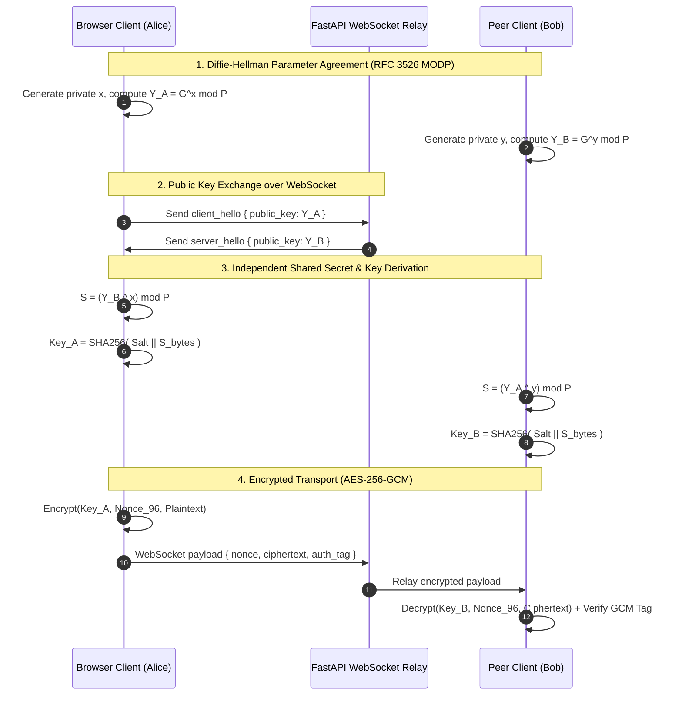

# CipherLink

**End-to-End Secure Messaging Prototype**

[](https://python.org)
[](https://fastapi.tiangolo.com)
[](https://reactjs.org)
[](https://vitejs.dev)
[](https://tailwindcss.com)
[](https://developer.mozilla.org/en-US/docs/Web/API/WebSockets_API)
[](tests/)
[](LICENSE)

> *"Secure communication powered by Diffie-Hellman key exchange and AES-256-GCM authenticated encryption."*

---

## 📌 Technical Overview

**CipherLink** is a full-stack, production-style web application and educational cybersecurity prototype designed to demonstrate real-time end-to-end encrypted messaging. It refactors a core academic Python Diffie-Hellman terminal application into a modern web application featuring:

- **Browser-to-Server & Peer-to-Peer DH Key Agreements**
- **SHA-256 Salted Key Derivation (KDF)**
- **AES-256-GCM Authenticated Encryption with 96-bit Random Nonces**
- **Real-Time Full-Duplex WebSockets (`/ws/chat` and `/ws/room/{id}`)**
- **Verified Cross-Language Cryptographic Interoperability (Python ↔ JavaScript Web Crypto API)**

> **Educational Security Disclaimer**: CipherLink is an educational prototype built to demonstrate cryptographic engineering concepts. It is not intended as a audited, production-grade replacement for Signal or double-ratchet E2EE protocols.

---

## ✨ Features

- 🔒 **Interactive Handshake Animation**: Visual 6-step cryptographic connection sequence modal (Connecting ➔ Key Pair ➔ Public Exchange ➔ Shared Secret ➔ SHA-256 KDF ➔ Secure Channel).
- 💬 **Encrypted Chat Interface**: Real-time messaging with `🔒 AES-GCM encrypted` message badges, timestamps, auto-scroll, character limits, and shortcuts (`Enter` / `Shift+Enter`).
- 👥 **Zero-Knowledge P2P Room Relay**: Create or join temporary session rooms. The server acts as a relay for public key exchange and ciphertexts without decrypting messages.
- 🧪 **Encryption Playground**: Sandbox for entering plaintext and inspecting real-time nonces, ciphertext, GCM authentication tags, and key fingerprints in Hex or Base64.
- 🛡️ **Security Center**: Interactive visual pipeline mapping the cryptographic flow with live safe metadata (no private keys or secrets are ever exposed or logged).
- 📊 **Security Metrics Dashboard**: Uptime counter, message metrics, cipher parameters, and health cards.
- 💻 **Backward-Compatible CLI**: Original `python server.py` and `python client.py` scripts remain operational alongside the new web architecture.

---

## 🏗️ Architecture & Protocol Flow

### Cryptographic Handshake Sequence



---

## 🛠️ Technology Stack

| Layer | Technologies |
| :--- | :--- |
| **Backend** | Python 3.10+, FastAPI, Uvicorn, WebSockets, Pytest, Pydantic v2 |
| **Cryptography** | `cryptography` (Python AES-GCM), Web Crypto API (JS AES-GCM), BigInt Modular Exponentiation |
| **Frontend** | React 18, Vite, Tailwind CSS, Lucide React, Framer Motion |
| **DevOps** | Docker, Docker Compose, Render (`render.yaml`), Vercel (`vercel.json`) |

---

## 🚀 Quick Start & Local Development

### Prerequisites
- Python 3.10+
- Node.js 18+ & npm

### 1. Install Backend Dependencies
```bash
pip install -r requirements.txt
```

### 2. Install Frontend Dependencies
```bash
cd frontend
npm install
cd ..
```

### 3. Run FastAPI Backend Server
```bash
python -m uvicorn app.main:app --reload --host 0.0.0.0 --port 8000
```
- API Documentation: `http://localhost:8000/docs`
- Health Check: `http://localhost:8000/api/health`

### 4. Run Frontend Development Server
```bash
cd frontend
npm run dev
```
- Open browser at `http://localhost:5173`

---

## 🧪 Automated Testing & Interoperability Verification

CipherLink includes a test suite verifying Python cryptographic primitives, REST routes, WebSocket handshakes, and **deterministic Python ↔ JavaScript cross-language interoperability**.

Run tests:
```bash
python -m pytest -v
```

### Test Suite Highlights:
- `tests/test_crypto.py`: Validates DH key agreement, AES-GCM encryption/decryption, tampered ciphertext rejection, and public key range bounds ($2 \le Y \le P-2$).
- `tests/test_interop.py`: Executes Node.js subprocess with `frontend/src/lib/crypto.js` to prove identical shared secrets, identical SHA-256 derived keys, and cross-decryption capability between Python and JavaScript.
- `tests/test_api.py`: Validates REST endpoints (`/api/health`, `/api/info`, `/api/demo/encrypt`).
- `tests/test_websocket.py`: Validates WebSocket DH handshake protocol and encrypted message echoes.

---

## 📦 Containerization & Deployment

### Run with Docker Compose
```bash
docker-compose up --build
```

### Deployment Configuration
- **Backend (Render / Railway / Fly.io)**: Deployment configured in `render.yaml`. Uvicorn web server supports persistent WebSocket connections.
- **Frontend (Vercel / Netlify)**: Deployment configured in `frontend/vercel.json` with SPA route rewrites.

---

## 📄 Legacy CLI Interface

The original terminal-based client-server scripts remain working:

Start terminal server:
```bash
python server.py
```

Start terminal client:
```bash
python client.py
```

---

## 🔑 Security Considerations & Design Decisions

1. **Zero Key Exposure**: Neither private exponents ($x, y$) nor raw shared secrets ($S$) are ever transmitted over the network, written to logs, or exposed in UI states.
2. **Fresh Nonce Per Message**: Every AES-GCM payload uses a fresh 96-bit cryptographically secure random nonce (`secrets.token_bytes(12)` in Python / `crypto.getRandomValues` in JS).
3. **Public Key Validation**: Incoming DH public keys are strictly validated against range bounds ($2 \le Y \le P-2$) to prevent invalid curve or small-subgroup attacks.
4. **Environment Controls**: Host, port, CORS origins, and debug modes are managed via `.env` environment variables.

---

## 📜 License

This project is open source and available under the [MIT License](LICENSE).
